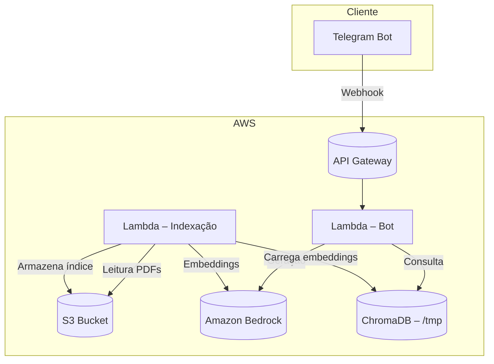

# 📚 Documentação Defensável do Assistente Jurídico com RAG

**Autor:** Igor Brito  
**Licença:** MIT (versão em português) – veja o arquivo [`LICENSE`](../LICENSE)

---

## Sumário

1. [Visão Geral](#visão-geral)
2. [Instalação](#instalação)
3. [Uso](#uso)
4. [Arquitetura](#arquitetura)
5. [Contribuição](#contribuição)
6. [Licença](#licença)

---

## Visão Geral

O **Assistente Jurídico com RAG** (Retrieval‑Augmented Generation) combina IA generativa com buscas semânticas em documentos jurídicos. Ele processa PDFs, gera embeddings via Amazon Bedrock, armazena‑os em um banco vetorial **ChromaDB** e oferece respostas através de um bot do Telegram.

Principais funcionalidades:
- Ingestão de documentos (PDF → texto → chunks).
- Geração de embeddings usando *Titan Embed* da Bedrock.
- Busca vetorial com ChromaDB.
- Chatbot Telegram que responde usando *Titan Text Express*.
- Cache de consultas para reduzir latência.

---

## Instalação

### Pré‑requisitos
- Python 3.10+
- AWS CLI configurada com permissões para Lambda, S3, Bedrock e API Gateway.
- Conta AWS com acesso ao Amazon Bedrock.
- Conta Telegram (BotFather) para obter token.

### Passos
1. **Clonar o repositório**
   ```bash
   git clone https://github.com/oigorbrito/jurirag.git
   cd jurirag
   ```
2. **Ambiente virtual**
   ```powershell
   python -m venv .venv
   .\.venv\Scripts\Activate
   ```
3. **Instalar dependências**
   ```bash
   pip install -r requirements.txt
   ```
4. **Variáveis de ambiente** (exemplo de `.env` – adicione ao `.gitignore`)
   ```text
   S3_BUCKET_NAME=seu-bucket
   S3_DOCUMENTS_KEY=juridicos.zip
   S3_EMBEDDINGS_KEY=chroma_index/index.tar.gz
   TELEGRAM_BOT_TOKEN=seu-token-bot
   ```
5. **Empacotar a Lambda** (script `zip_lambda.ps1` incluído)
   ```powershell
   .\zip_lambda.ps1   # gera lambda_package.zip
   ```
6. **Deploy na AWS**
   - Crie duas funções Lambda (indexação e bot) e faça upload do ZIP.
   - Defina os handlers: `lambda_function.perform_indexation` e `telegram_bot.lambda_handler`.
   - Crie API Gateway que aponte para a função do bot.
   - Configure o webhook do Telegram apontando para a URL da API Gateway.

---

## Uso

### Indexação dos documentos
Execute a função Lambda de indexação (pode ser disparada manualmente ou por evento S3). Exemplo via AWS CLI:
```bash
aws lambda invoke \
    --function-name jurirag-index \
    --payload '{}' \
    response.json
```
A função baixa `juridicos.zip` do S3, gera embeddings e salva o índice `index.tar.gz` de volta no bucket.

### Interagindo com o bot
Abra o chat do bot no Telegram e use:
- `/start` – inicia a conversa.
- `/help` – exibe instruções.
- Mensagens de texto livre – o bot responde usando o índice criado.

### Testes locais (opcional)
Com o **AWS SAM CLI**:
```bash
sam local invoke -e events/index_event.json   # testa indexação
sam local invoke -e events/bot_event.json     # testa o bot
```

---

## Arquitetura



- **Lambda – Indexação** (`lambda_function.py`): processa PDFs, gera embeddings e cria índice.
- **Lambda – Bot** (`telegram_bot.py`): recebe mensagens, busca no índice e gera respostas.
- **Amazon Bedrock**: fornece os modelos de embeddings e geração de texto.
- **ChromaDB**: banco vetorial usado para busca semântica.
- **S3**: armazena PDFs, índice e artefatos.
- **API Gateway**: expõe o endpoint para o webhook do Telegram.

---

## Contribuição

Agradecemos seu interesse em contribuir! Siga estas etapas para garantir que a documentação e o código continuem **defensáveis**.

1. **Fork** o repositório e crie uma branch descritiva:
   ```bash
   git checkout -b feature/minha-alteracao
   ```
2. **Faça suas alterações** (código ou docs). Mantenha a menção ao **Autor: Igor Brito** em novos arquivos.
3. **Commit** usando convenções:
   - `✨ feat: descrição` para novas funcionalidades.
   - `📚 docs: atualização da documentação`.
4. **Abra um Pull Request**. O CI (GitHub Actions) deverá passar.
5. **Revise** eventuais comentários e **merge** quando aprovado.

### Código de Conduta
Este projeto segue o **Contributor Covenant v2.1**. Ao participar, você concorda em respeitar todos os colaboradores.

---

## Licença

Distribuído sob a licença **MIT** (versão em português). Consulte o arquivo [`LICENSE`](../LICENSE) para detalhes completos.

---

*Esta documentação foi produzida para garantir a correta atribuição ao autor e a clareza sobre os termos de uso, facilitando a utilização, manutenção e redistribuição do projeto.*
